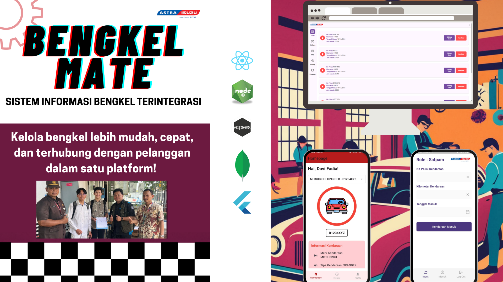
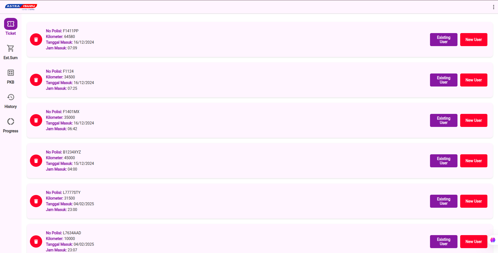

<div align="center">
<h1>🔧 WORKSHOP MANAGEMENT SYSTEM FOR ASTRA WARU - INTERNAL WEBSITE
</h1>
<a href="https://github.com/still-breath/webapp-astrawaru.git">
    
</a>
</div>

<p align="center">
<a target="_blank" href="https://www.linkedin.com/in/syahrulahmad/"></a>
<a target="_blank" href="https://github.com/still-breath/webapp-astrawaru"></a>
<a target="_blank" href="https://github.com/still-breath/webapp-astrawaru"></a>
<a target="_blank" href="https://github.com/still-breath/webapp-astrawaru"></a>
</p>

<p align="center">
<a href="#-introduction">Introduction</a> &nbsp;&bull;&nbsp;
<a href="#-tech-stack">Tech Stack</a> &nbsp;&bull;&nbsp;
<a href="#-preview">Preview</a> &nbsp;&bull;&nbsp;
<a href="#-system-architecture">System Architecture</a> &nbsp;&bull;&nbsp;
<a href="#-user-roles">User Roles</a> &nbsp;&bull;&nbsp;
<a href="#-installation--usage">Installation & Usage</a> &nbsp;&bull;&nbsp;
<a href="#-team-collaboration">Team Collaboration</a> &nbsp;&bull;&nbsp;
<a href="#-issue">Issue</a>&nbsp;&bull;&nbsp;
<a href="#-license">License</a>&nbsp;&bull;&nbsp;
<a href="#-team">Team</a>
</p>

---

## 📄 Introduction

This project is a comprehensive **spare parts management system** designed for automotive service centers. The system provides **role-based access control** with three distinct user types: Security Guards (Satpam), Service Advisors, and Spare Parts Staff. Built with modern web technologies, it offers efficient workflow management from ticket creation to parts distribution.

### 🎯 Key Features
- **Role-Based Authentication**: JWT-based authentication with three user roles
- **Ticket Management**: Complete workflow from ticket creation to completion
- **Parts Inventory**: Real-time spare parts tracking and management
- **Progress Monitoring**: Service progress tracking with detailed history
- **Cost Estimation**: Automated service and parts cost calculation
- **Mobile Responsive**: Optimized for both desktop and mobile usage
- **Real-time Updates**: Live status updates across all user interfaces
- **Data Analytics**: Comprehensive reporting and analytics dashboard
- **Mobile App Integration**: Flutter mobile app for field operations

This system demonstrates modern **full-stack development** with emphasis on user experience, security, and operational efficiency for automotive service management across web and mobile platforms.

---

## 💻 Tech Stack

Frameworks, Libraries, and Tools used in this project:

### 🌐 Frontend (Web)
<p align="center">
<a target="_blank" href="https://reactjs.org/">

</a>
<a target="_blank" href="https://developer.mozilla.org/en-US/docs/Web/JavaScript">

</a>
<a target="_blank" href="https://sass-lang.com/">

</a>
<a target="_blank" href="https://vitejs.dev/">

</a>
</p>

### 📱 Mobile
<p align="center">
<a target="_blank" href="https://flutter.dev/">

</a>
<a target="_blank" href="https://dart.dev/">

</a>
</p>

### ⚙️ Backend
<p align="center">
<a target="_blank" href="https://nodejs.org/">

</a>
<a target="_blank" href="https://expressjs.com/">

</a>
<a target="_blank" href="https://www.mongodb.com/">

</a>
<a target="_blank" href="https://jwt.io/">

</a>
</p>

### 🔧 Development Tools
<p align="center">
<a target="_blank" href="https://axios-http.com/">

</a>
<a target="_blank" href="https://reactrouter.com/">

</a>
<a target="_blank" href="https://react-hook-form.com/">

</a>
</p>

---

## 🖼️ Preview

<div align="center">

</div>

### 📱 Application Screenshots

#### 🔐 Authentication & Dashboard
- **Login System**: JWT-based authentication with role-based redirection
- **Dashboard Overview**: Role-specific dashboard with relevant metrics and actions

#### 🎫 Ticket Management (Satpam/Security Guard)
- **Ticket Creation**: Create service tickets with customer information
- **Ticket List**: View and manage all service tickets
- **Status Tracking**: Real-time ticket status updates

#### 👨‍💼 Service Management (Service Advisor)
- **Progress Tracking**: Monitor service progress and update status
- **Cost Estimation**: Calculate service costs and spare parts pricing
- **Customer Communication**: Manage customer interactions and updates

#### 🔧 Parts Management (Spare Parts Staff)
- **Inventory Management**: Real-time spare parts inventory tracking
- **Parts Distribution**: Manage parts allocation and distribution
- **Stock Updates**: Update inventory levels and availability

#### 📱 Mobile Application (Flutter)
- **Cross-Platform**: Native performance on both iOS and Android
- **Offline Capability**: Work offline with data synchronization
- **Field Operations**: Mobile-optimized interface for field staff
- **Real-time Sync**: Instant synchronization with web platform

### 📊 System Workflow
1. **Ticket Creation** → Security creates service tickets
2. **Service Assignment** → Service advisor receives and processes tickets  
3. **Parts Request** → Required parts are identified and requested
4. **Parts Distribution** → Spare parts staff manages inventory and distribution
5. **Mobile Updates** → Field staff updates via mobile app
6. **Progress Updates** → Real-time status updates across all platforms
7. **Service Completion** → Final cost calculation and service completion

---

### 🔄 Core System Flow

#### 1. **Efisiensi (Efficiency)**
- **Web & Mobile Apps**: Unified interface across platforms
- **Real-time Processing**: Instant data synchronization between web and mobile
- **Automated Workflows**: Streamlined processes from ticket to completion

#### 2. **Sentralisasi (Centralization)** 
- **Centralized Data Management**: Single source of truth via API backend
- **MongoDB Database**: Scalable document-based storage
- **API Integration**: RESTful APIs for seamless web and mobile data exchange

#### 3. **Customer Focus**
- **Customer-Centric Design**: User experience optimized for service efficiency
- **Role-Based Interfaces**: Specialized views for different user types
- **Real-time Updates**: Live status tracking for enhanced customer service

#### 4. **Distribusi (Distribution)**
- **QR Code Integration**: Digital tracking for parts and service orders
- **Mobile Field Operations**: Flutter app for on-site technicians
- **Automated Distribution**: Streamlined spare parts allocation system
- **Cross-Platform Accessibility**: Web dashboard and mobile field app

### 🔧 Technical Architecture
- **Frontend Web**: React with JavaScript and SCSS for styling
- **Frontend Mobile**: Flutter with Dart for cross-platform mobile app
- **Backend**: Node.js/Express API with MongoDB
- **Authentication**: JWT-based security with role management
- **State Management**: React Context API and custom hooks
- **Real-time Updates**: WebSocket integration for live updates
- **Build Tool**: Vite for fast development and building

---

## 👥 User Roles

### 🛡️ Satpam (Security Guard)
**Primary Responsibilities:**
- Create service tickets for incoming customers
- Collect customer and vehicle information
- Initial service request documentation
- Ticket status monitoring

**Key Features:**
- **Ticket Creation Form**: Comprehensive customer and vehicle data entry
- **Ticket List View**: Overview of all created tickets
- **Status Dashboard**: Real-time ticket status tracking
- **Customer Information Management**: Maintain customer database

### 👨‍💼 Service Advisor  
**Primary Responsibilities:**
- Review and process service tickets
- Provide service estimates and recommendations
- Coordinate with spare parts staff
- Update service progress and communicate with customers

**Key Features:**
- **Service Dashboard**: Overview of assigned tickets and progress
- **Cost Estimation Tools**: Automated pricing calculation
- **Progress Management**: Update service status and milestones
- **Customer Communication**: Direct customer interaction interface

### 🔧 Spare Parts Staff
**Primary Responsibilities:**
- Manage spare parts inventory
- Process parts requests from service advisors
- Track parts availability and stock levels
- Handle parts distribution and allocation

**Key Features:**
- **Inventory Management**: Real-time stock tracking and updates
- **Parts Request Processing**: Handle and fulfill parts requests
- **Stock Alerts**: Low inventory notifications and reorder management
- **Distribution Tracking**: Monitor parts allocation and usage

### 📱 Mobile Field Staff
**Primary Responsibilities:**
- Update service progress from field locations
- Scan QR codes for parts and service tracking
- Upload photos and documentation
- Access customer and service information on-the-go

**Key Features:**
- **Mobile Dashboard**: Field-optimized interface
- **Offline Capability**: Work without internet connection
- **Photo Documentation**: Capture and upload service photos
- **QR Code Scanner**: Quick access to parts and service information

### 🔑 Authentication & Authorization
- **JWT-based Security**: Secure token-based authentication
- **Role-based Access Control**: Different interfaces and permissions per role
- **Session Management**: Secure session handling with automatic logout
- **Password Security**: Encrypted password storage and validation

---

## ⚙️ Installation & Usage

### 📋 Prerequisites
- Node.js 16+ and npm/yarn
- MongoDB 4.4+ (local or cloud instance)
- Git for version control
- Modern web browser with JavaScript enabled
- Flutter SDK (for mobile development)
- Android Studio/Xcode (for mobile app development)

### 🔧 Step-by-Step Installation

#### 1. Clone Repository
```bash
# Clone the repository
git clone https://github.com/still-breath/webapp-astrawaru.git
cd webapp-astrawaru
```

#### 2. Backend Setup
```bash
# Navigate to backend directory
cd backend

# Install backend dependencies
npm install

# Setup environment variables
cp .env.example .env
```

#### 3. Environment Configuration
```bash
# Edit .env file with your configurations
nano .env

# Required environment variables:
PORT=5000
MONGODB_URI=mongodb://localhost:27017/spareparts_db
JWT_SECRET=your_super_secure_jwt_secret_key
JWT_EXPIRE=7d
NODE_ENV=development
CORS_ORIGIN=http://localhost:5173
```

#### 4. Database Setup
```bash
# Start MongoDB service (if using local MongoDB)
# For Windows:
net start MongoDB

# For Linux/macOS:
sudo systemctl start mongod

# Initialize database with sample data (optional)
npm run seed
```

#### 5. Frontend Web Setup
```bash
# Navigate to frontend directory (new terminal)
cd frontend

# Install frontend dependencies
npm install

# Setup environment variables
cp .env.example .env.local
```

#### 6. Frontend Environment Configuration
```bash
# Edit .env.local file
nano .env.local

# Required environment variables:
VITE_API_BASE_URL=http://localhost:5000/api
VITE_APP_TITLE=Spare Parts Management System
```

#### 7. Mobile App Setup (Optional)
```bash
# Navigate to mobile directory
cd mobile

# Get Flutter dependencies
flutter pub get

# Setup environment configuration
cp lib/config/config.example.dart lib/config/config.dart

# Edit config file with your API endpoint
nano lib/config/config.dart
```

### 🚀 Running the Application

#### Development Mode
```bash
# Terminal 1: Start Backend Server
cd backend
npm run dev
# Backend will run on http://localhost:5000

# Terminal 2: Start Frontend Web Development Server
cd frontend
npm run dev
# Frontend will run on http://localhost:5173

# Terminal 3: Start Mobile App (Optional)
cd mobile
flutter run
# Mobile app will launch on connected device/emulator
```

#### Production Build
```bash
# Build frontend for production
cd frontend
npm run build

# Build mobile app for production
cd mobile
flutter build apk # for Android
flutter build ios # for iOS

# Start production server
cd ../backend
npm run start
```

### 📁 Project Structure
```
webapp-astrawaru/
├── backend/
│   ├── controllers/         # Route controllers
│   ├── middleware/          # Authentication & validation
│   ├── models/             # MongoDB models
│   ├── routes/             # API routes
│   ├── utils/              # Utility functions
│   ├── config/             # Database configuration
│   └── server.js           # Express server setup
├── frontend/
│   ├── src/
│   │   ├── components/     # Reusable React components
│   │   ├── pages/          # Page components
│   │   ├── contexts/       # React Context providers
│   │   ├── hooks/          # Custom React hooks
│   │   ├── services/       # API service functions
│   │   ├── utils/          # Utility functions
│   │   ├── styles/         # SCSS stylesheets
│   │   └── main.jsx        # Application entry point
│   ├── public/             # Static assets
│   ├── vite.config.js      # Vite configuration
│   └── package.json
├── mobile/
│   ├── lib/
│   │   ├── screens/        # Flutter screen widgets
│   │   ├── widgets/        # Reusable widgets
│   │   ├── services/       # API services
│   │   ├── models/         # Data models
│   │   ├── utils/          # Utility functions
│   │   └── main.dart       # Flutter app entry point
│   ├── android/            # Android-specific files
│   ├── ios/                # iOS-specific files
│   └── pubspec.yaml        # Flutter dependencies
└── README.md
```

### 🔑 Default Login Credentials

#### Satpam (Security Guard)
```
Email: satpam@company.com
Password: satpam123
Role: security
```

#### Service Advisor
```
Email: advisor@company.com
Password: advisor123
Role: service_advisor
```

#### Spare Parts Staff
```
Email: spareparts@company.com
Password: spareparts123
Role: sparepart
```

---

## 🤝 Team Collaboration

This project was developed as a **collaborative team effort** with three specialized roles:

### 👨‍💻 Development Team Structure

#### **Frontend Web Developer (Lead)**
- **Role**: React.js Frontend Development Lead
- **Responsibilities**:
  - React component architecture and development
  - JavaScript implementation and ES6+ features
  - Responsive UI/UX design with SCSS
  - State management and React hooks
  - API integration and data flow
  - User authentication and role-based routing
  - Vite build configuration and optimization

#### **Backend Developer**
- **Role**: Node.js/Express API Development
- **Responsibilities**:
  - RESTful API design and implementation
  - MongoDB database schema design
  - JWT authentication and authorization
  - API security and data validation
  - Database queries and optimization
  - Server configuration and deployment

#### **Mobile App Developer**
- **Role**: Flutter Mobile Application Development
- **Responsibilities**:
  - Cross-platform mobile app development with Flutter
  - Dart programming and widget development
  - Mobile UI/UX design and implementation
  - API integration for mobile platform
  - Offline data storage and synchronization
  - Mobile-specific features (camera, QR scanner, GPS)
  - iOS and Android deployment

### 🔄 Development Workflow

#### **Agile Development Process**
1. **Sprint Planning**: Weekly planning sessions for feature development
2. **Task Distribution**: GitHub Issues and project boards for task management
3. **Code Reviews**: Pull request reviews for code quality assurance
4. **Daily Standups**: Progress updates and blocker discussions
5. **Cross-Platform Testing**: Web, iOS, and Android testing coordination
6. **Integration Testing**: API testing across web and mobile platforms

#### **Collaboration Tools**
- **Version Control**: Git with GitHub for code management
- **Communication**: Discord/Slack for daily communication
- **Project Management**: GitHub Projects for task tracking
- **Documentation**: Shared Google Docs for specifications
- **Design**: Figma for UI/UX design collaboration
- **Mobile Testing**: Firebase Test Lab for device testing

#### **Development Standards**
- **Code Style**: ESLint and Prettier for consistent code formatting
- **Component Structure**: Atomic design principles for React components
- **Mobile Standards**: Flutter best practices and material design
- **API Design**: RESTful conventions with proper HTTP status codes
- **Testing**: Unit tests and integration tests for critical features
- **Cross-Platform**: Consistent API responses for web and mobile

### 📊 Team Contribution Distribution
- **Frontend Web Development**: 40% - React components, SCSS styling, web UI/UX
- **Backend Development**: 35% - API development, database design, security
- **Mobile Development**: 25% - Flutter app, mobile UI/UX, cross-platform features

---

## 🚩 Issue

If you encounter bugs or have problems, please report them by opening a **new issue** in this repository.

### 📋 Issue Template
When reporting issues, please include:
- Problem description and expected behavior
- Steps to reproduce the issue
- Platform (Web/Mobile) and user role information
- Browser information (for web) or device info (for mobile)
- Environment details (OS, Node.js version, MongoDB version, Flutter version)
- Screenshots of error messages or UI issues
- Network requests/responses (for API issues)

### 🔍 Common Issues and Solutions

#### Authentication Issues:
- **Login failures**: Check JWT secret configuration and token expiration
- **Role access denied**: Verify user role assignments in database
- **Session expired**: Implement automatic token refresh mechanism

#### Database Connection Issues:
- **MongoDB connection failed**: Verify MongoDB service status and connection string
- **Data not persisting**: Check MongoDB write permissions and disk space
- **Query performance**: Review database indexes and query optimization

#### Frontend Web Issues:
- **Component not rendering**: Check React component lifecycle and state management
- **API calls failing**: Verify backend server status and CORS configuration
- **SCSS compilation**: Check Vite configuration and SCSS syntax
- **Responsive design issues**: Test on different screen sizes and browsers

#### Mobile App Issues:
- **Flutter build errors**: Check Flutter SDK version and dependencies
- **API connectivity**: Verify network permissions and endpoint configuration
- **Platform-specific issues**: Test on both iOS and Android devices
- **Performance issues**: Profile app performance and optimize widget rebuilds

#### Performance Issues:
- **Slow page loading**: Optimize component rendering and implement code splitting
- **Memory leaks**: Check for proper component cleanup and event listener removal
- **API response time**: Implement database query optimization and caching
- **Mobile performance**: Optimize Flutter widget tree and image loading

---

## 📝 License

This project is licensed under the **MIT License** - see the [LICENSE](LICENSE) file for details.

---

## 👥 Team

<div align="center">

### 🏆 Development Team

<div align="center">

<p><em>Our collaborative development team working together</em></p>
</div>

<table>
<tr>
<td align="center">
<h4>🧑‍💻 Frontend Web Developer (Lead)</h4>
<p><strong>Syahrul Fathoni Ahmad</strong></p>
<p><em>React.js Specialist | JavaScript & SCSS Expert</em></p>
<p>
<a target="_blank" href="https://www.linkedin.com/in/syahrulahmad/">

</a>
<a target="_blank" href="https://github.com/still-breath">

</a>
</p>
</td>
<td align="center">
<h4>⚙️ Backend Developer</h4>
<p><strong>Team Member #2</strong></p>
<p><em>Node.js Specialist | API Development Expert</em></p>
<p>

</p>
</td>
<td align="center">
<h4>📱 Mobile App Developer</h4>
<p><strong>Team Member #3</strong></p>
<p><em>Flutter Specialist | Cross-Platform Expert</em></p>
<p>

</p>
</td>
</tr>
</table>

### 🎯 Project Highlights
- **Team Collaboration**: Successfully delivered as a 3-person development team
- **Multi-Platform System**: Web application with React and mobile app with Flutter
- **Role-Based System**: Comprehensive user role management and authentication  
- **Modern Tech Stack**: React, JavaScript, SCSS, Flutter, Node.js, and MongoDB integration
- **Industry Application**: Real-world automotive service management solution
- **Cross-Platform Integration**: Seamless data synchronization between web and mobile platforms

</div>

---

<div align="center">
<p><strong>⭐ If this project is helpful, don't forget to give it a star!</strong></p>
<p><em>Created with ❤️ for advancing automotive service management and cross-platform development</em></p>
</div>